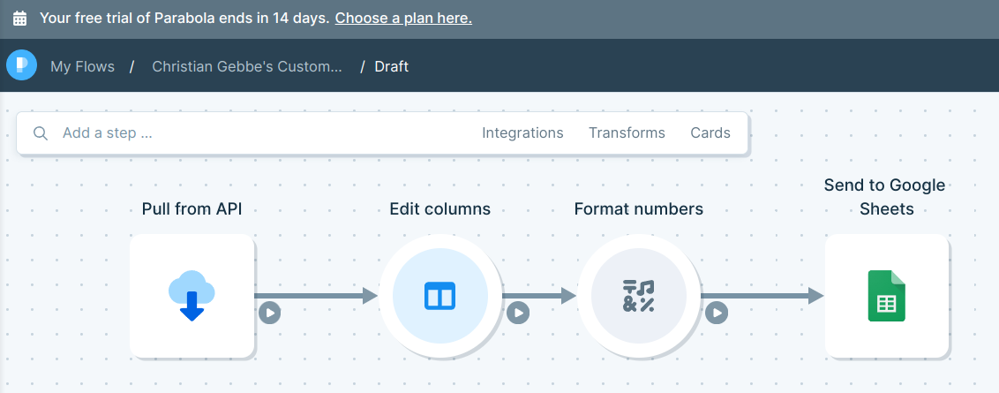
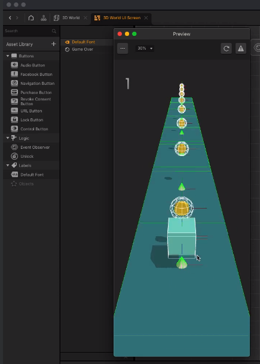

# udemy No Code developer course

https://www.udemy.com/course/no-code-developer/

- [udemy No Code developer course](#udemy-no-code-developer-course)
- [1 intro](#1-intro)
- [2 no-code fundamentals](#2-no-code-fundamentals)
- [3 scraping](#3-scraping)
- [4 APIs](#4-apis)
- [5 Automation](#5-automation)
- [6 (Slack)Bots](#6-slackbots)
- [7 Data Science](#7-data-science)
- [8 Voice App](#8-voice-app)
- [9 Website design](#9-website-design)
- [10 One-page website with HTML and CSS](#10-one-page-website-with-html-and-css)
- [11 Mobile App](#11-mobile-app)
- [12 Webflow](#12-webflow)
- [13 Buildbox](#13-buildbox)

# 1 intro

- Obviously AI [Coupon Code: RAVINDER100]
  - 3 Months Of Free Access - Pro Plan.
- Voiceflow [To Claim, Email: emily@voiceflow.com]
  - $15 Per Month (RRP: $50) - Pro Plan.
  - Note: Mention you are coming from this course.

# 2 no-code fundamentals

- dreamweaver started
- later webflow picked it up again

overview today

- https://medium.com/@rrhoover/the-rise-of-no-code-e733d7c0944d
- https://pinver.medium.com/mapping-the-future-of-work-startup-investor-ecosystem-2db5049f2c86
  - https://docs.google.com/spreadsheets/d/1cDkd0sdCJl-vCSSx5-xmsDRo_4EAf4wq8LXzPBhEzrc/edit#gid=0

# 3 scraping

Use [SimpleScraper](https://simplescraper.io/) (google chrome extension) to get (name, URL, rating) from https://www.seedtable.com/investors-germany

SimpleScraper features

- infinite scroll
- scheduled runs on the cloud (paid version)
- deep scraping (follow links)
- ...

# 4 APIs

Use https://parabola.io/ (24$ mio funding) to create a worlfow:

- request data from [coinAPI.io](https://docs.coinapi.io/market-data/rest-api/exchange-rates)
- process data
- save it in google sheets

# 5 Automation

Use https://zapier.com/ to create and activate a workflow:

- Whenever google sheet row is updated or added
- post value on twitter

# 6 (Slack)Bots

Use https://zapier.com/ to create another workflow:

- listen to slack channel
- add filter (only continue if text contains $KEYWORD)
- find GIF in Giphy
- post to slack channel

# 7 Data Science

Use https://www.obviously.ai/ to analyze prices of avocados based on historic prices and 4 other featuers. It trains a prediction model and returns feature importance (not future prices?)

- obvoiously.ai has no free plan anymore (cheapest one for 300 USD, with data scientist for 999 USD)
- free alternative: https://www.gyana.com/

# 8 Voice App

Use https://www.voiceflow.com/ to build, test and deploy the following voice-based workflows:

- setup trigger: Whenever "stocks today" is mentioned in alexa / custom chat assistant / custom voice assistant
- welcome message
- choice input (yes/no/no-match) - "do you want to know stock price?"
- confirmation message
- free input (stock name)
- call API - get price from https://site.financialmodelingprep.com/
- stock price message
- goto choice input block (loop)

# 9 Website design

Use https://www.figma.com/ to design a website (think photoshop / inkscape).

- collaborative with comments
- can create new components (e.g. wireframe parts)
- export to CSS (?! didn't see that)
- many plugins, see https://uxplanet.org/10-ai-figma-plugins-every-ui-ux-designer-must-try-d71a9acff1e
- likely a lot more, because company valued at 20 bio USD !
- also offers FigJam, which is even more (?) collaborative

NOTES:

- Similar tool for only wireframes is https://moqups.com/ , but free version is more limited apparently.
- Find completley free, commercially usable images on https://unsplash.com/ (money through ads, photographes use it as portfolio)

# 10 One-page website with HTML and CSS

Use https://carrd.co/ to create a simple one-webpage website with a form that signs you up using https://www.mailerlite.com/ .

- publishes directly to a website (xxx.card.co or custom domain (PRO))
- really nice responsive design working on all devices
- does it have dynamic elements? -> No, only forms
- great free plan: 3 sites per account

# 11 Mobile App

Use https://www.glideapps.com/ to develop and publish a mobile app which

- inputs graffiti data from google sheets (name, description, image, address)
- presents data as list, map, etc.
- is published as a very mobile-friendly website

# 12 Webflow

Use https://webflow.com/ to create a membership website

- create two pages via drag-drop elements
- export site: HTML, CSS, JS and assets
- make site mobile-friendly via device-view
- publish on https://app.memberstack.io/my-site
- connect site to https://www.memberspace.com/ to make one page member-only and allow member sign-up
- connect subscribe-button to https://sendfox.com/ via https://zapier.com/ (both apps don't talk directly to each other)

# 13 Buildbox

Use https://signup.buildbox.com/product/bb3 to design a simple 3D jumpnrun game

- you, a square, must jump over triangles and collect points
- game is published to google/iOS app store.

NOTE: The same company also offers an AI version for very simple games: https://storygames.buildbox.com/

